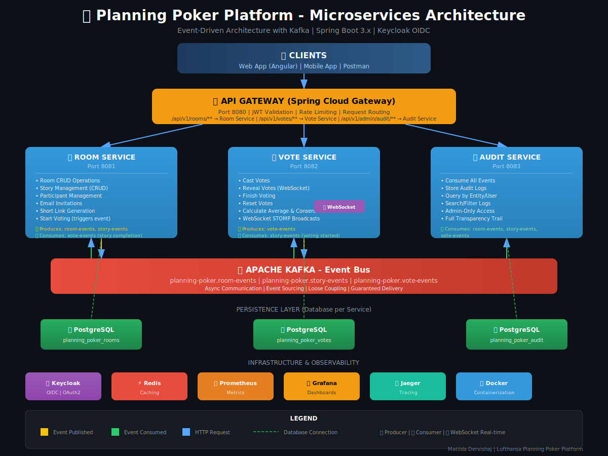

# 🎯 Planning Poker Platform

A **microservices-based Planning Poker application** for agile teams to collaboratively estimate task complexity. Built with Spring Boot 3.x, Keycloak for authentication, Kafka for event-driven communication, and WebSocket for real-time updates.


---

## 📋 Table of Contents

- [Quick Start](#-quick-start)
- [Architecture](#-architecture)
- [Services](#-services)
- [Technology Stack](#-technology-stack)
- [API Documentation](#-api-documentation)
- [Authentication](#-authentication)
- [Design Decisions](#-design-decisions)
- [Running Tests](#-running-tests)
- [Project Structure](#-project-structure)

---

## 🚀 Quick Start

### Prerequisites

- **Docker** & **Docker Compose** (v2.0+)
- **Java 17** (for local development)
- **Maven 3.8+** (or use included Maven wrapper)

### One-Command Startup

```bash
docker compose up -d
```

This starts the entire stack:

| Service | URL | Description |
|---------|-----|-------------|
| **API Gateway** | http://localhost:8080 | Single entry point |
| **Room Service** | http://localhost:8081 | Room & Story management |
| **Vote Service** | http://localhost:8082 | Voting & WebSocket |
| **Audit Service** | http://localhost:8083 | Audit logging |
| **Keycloak** | http://localhost:8180 | Identity Provider |
| **Prometheus** | http://localhost:9090 | Metrics |
| **Grafana** | http://localhost:3000 | Dashboards (admin/admin) |
| **Jaeger** | http://localhost:16686 | Distributed Tracing |

### Setup Keycloak (First Time Only)

1. Open http://localhost:8180 → Login: `admin` / `admin`
2. Import realm from `keycloak/realm-export.json`
3. Or manually create realm `planning-poker` with users

### Verify Services

```bash
# Health checks
curl http://localhost:8081/actuator/health
curl http://localhost:8082/actuator/health
curl http://localhost:8083/actuator/health

# Swagger Documentation
open http://localhost:8081/swagger-ui.html
```

---

## 🏗 Architecture

### Architecture Diagram



📄 **Full Technical Documentation:** [docs/Planning_Poker_Platform_Documentation.docx](docs/Planning_Poker_Platform_Documentation.docx)

### System Overview

```
┌─────────────────────────────────────────────────────────────────────────────┐
│                              CLIENTS                                        │
│                    (Web App / Mobile App / Postman)                         │
└─────────────────────────────────┬───────────────────────────────────────────┘
                                  │
                                  ▼
┌─────────────────────────────────────────────────────────────────────────────┐
│                          API GATEWAY (8080)                                 │
│                    JWT Validation │ Rate Limiting │ Routing                 │
└─────────────────────────────────┬───────────────────────────────────────────┘
                                  │
            ┌─────────────────────┼─────────────────────┐
            │                     │                     │
            ▼                     ▼                     ▼
┌───────────────────┐ ┌───────────────────┐ ┌───────────────────┐
│  ROOM SERVICE     │ │  VOTE SERVICE     │ │  AUDIT SERVICE    │
│     (8081)        │ │     (8082)        │ │     (8083)        │
│                   │ │                   │ │                   │
│ • Room CRUD       │ │ • Cast Votes      │ │ • Event Consumer  │
│ • Story CRUD      │ │ • Reveal/Finish   │ │ • Audit Logs API  │
│ • Participants    │ │ • WebSocket STOMP │ │ • Search/Filter   │
│ • Short Links     │ │ • Vote Results    │ │                   │
└────────┬──────────┘ └────────┬──────────┘ └────────┬──────────┘
         │                     │                     │
         │         ┌───────────┴───────────┐         │
         │         │                       │         │
         ▼         ▼                       ▼         ▼
┌─────────────────────────────────────────────────────────────────────────────┐
│                            KAFKA EVENT BUS                                  │
│              room-events │ story-events │ vote-events                       │
└─────────────────────────────────────────────────────────────────────────────┘
         │                     │                     │
         ▼                     ▼                     ▼
┌───────────────────┐ ┌───────────────────┐ ┌───────────────────┐
│   PostgreSQL      │ │   PostgreSQL      │ │   PostgreSQL      │
│   (rooms DB)      │ │   (votes DB)      │ │   (audit DB)      │
└───────────────────┘ └───────────────────┘ └───────────────────┘

┌─────────────────────────────────────────────────────────────────────────────┐
│                         INFRASTRUCTURE                                      │
│   Keycloak (Auth) │ Redis (Cache) │ Prometheus (Metrics) │ Jaeger (Tracing) │
└─────────────────────────────────────────────────────────────────────────────┘
```

### Event Flow

```
User Creates Room → Room Service → Kafka (room-events) → Audit Service
User Casts Vote  → Vote Service  → Kafka (vote-events) → Audit Service
                                 → WebSocket → All Participants
```

---

## 🔧 Services

### 1. Room Service (pp-room-service)

**Responsibilities:**
- Room CRUD operations
- Story management
- Participant management
- Short link generation for invites

**Key Endpoints:**
| Method | Endpoint | Description |
|--------|----------|-------------|
| POST | `/api/v1/rooms` | Create room |
| GET | `/api/v1/rooms/{id}` | Get room by ID |
| POST | `/api/v1/rooms/join/{shortCode}` | Join room |
| POST | `/api/v1/rooms/{roomId}/stories` | Create story |
| POST | `/api/v1/stories/{id}/start-voting` | Start voting |

### 2. Vote Service (pp-vote-service)

**Responsibilities:**
- Vote casting and management
- Vote results calculation
- Real-time WebSocket broadcasts
- Consensus detection

**Key Endpoints:**
| Method | Endpoint | Description |
|--------|----------|-------------|
| POST | `/api/v1/votes` | Cast vote |
| GET | `/api/v1/votes/stories/{storyId}/count` | Get vote count |
| POST | `/api/v1/voting/stories/{storyId}/reveal` | Reveal votes |
| POST | `/api/v1/voting/stories/{storyId}/finish` | Finish voting |

**WebSocket Topics:**
- `/topic/room/{roomId}/votes` - Vote count updates
- `/topic/room/{roomId}/results` - Vote results

### 3. Audit Service (pp-audit-service)

**Responsibilities:**
- Consume events from Kafka
- Store audit logs
- Provide audit log queries (Admin only)

**Key Endpoints:**
| Method | Endpoint | Description |
|--------|----------|-------------|
| GET | `/api/v1/admin/audit` | Get all audit logs |
| GET | `/api/v1/admin/audit/entity/{type}/{id}` | Filter by entity |
| GET | `/api/v1/admin/audit/user/{userId}` | Filter by user |

### 4. API Gateway (pp-gateway)

**Responsibilities:**
- Single entry point for all services
- JWT token validation
- Request routing

---

## 💻 Technology Stack

| Category | Technology | Version |
|----------|------------|---------|
| **Framework** | Spring Boot | 3.4.x |
| **Language** | Java | 17 LTS |
| **Database** | PostgreSQL | 16 |
| **Cache** | Redis | 7 |
| **Message Broker** | Apache Kafka | 7.5 |
| **Identity** | Keycloak | 24.0 |
| **API Docs** | SpringDoc OpenAPI | 2.7.0 |
| **DB Migrations** | Liquibase | 4.x |
| **Build** | Maven | 3.9+ |
| **Containers** | Docker | 24+ |

---

## 📚 API Documentation

Swagger UI is available for each service:

- **Room Service:** http://localhost:8081/swagger-ui.html
- **Vote Service:** http://localhost:8082/swagger-ui.html
- **Audit Service:** http://localhost:8083/swagger-ui.html

### Getting a JWT Token

```powershell
# PowerShell
$body = "grant_type=password&client_id=planning-poker-web&username=testuser&password=test123"
$response = Invoke-RestMethod -Uri "http://localhost:8180/realms/planning-poker/protocol/openid-connect/token" -Method POST -ContentType "application/x-www-form-urlencoded" -Body $body
$response.access_token
```

```bash
# Bash/cURL
curl -X POST "http://localhost:8180/realms/planning-poker/protocol/openid-connect/token" \
  -H "Content-Type: application/x-www-form-urlencoded" \
  -d "grant_type=password&client_id=planning-poker-web&username=testuser&password=test123"
```

---

## 🔐 Authentication

The platform uses **Keycloak** for identity management with **OIDC/OAuth2**.

### Roles

| Role | Permissions |
|------|-------------|
| `USER` | Basic access |
| `MODERATOR` | Create rooms, manage stories, control voting |
| `PARTICIPANT` | Join rooms, cast votes |
| `ADMIN` | Full access, audit logs, user management |

### Importing Keycloak Configuration

```bash
# Import the provided realm configuration
# Go to Keycloak Admin → Realm Settings → Action → Import
# Select: keycloak/realm-export.json
```

### Enabling Social Login (Google/Facebook)

The realm configuration includes pre-configured identity providers (disabled by default):

1. Go to Keycloak Admin → Identity Providers
2. Select Google or Facebook
3. Enable the provider
4. Replace placeholder values with your OAuth credentials:
   - **Google:** Get credentials from [Google Cloud Console](https://console.cloud.google.com/apis/credentials)
   - **Facebook:** Get credentials from [Facebook Developers](https://developers.facebook.com/apps/)

### Admin User Management

Admin users manage platform users through **Keycloak Admin Console**:

1. Access: http://localhost:8180/admin
2. Login: `admin` / `admin`
3. Go to: Realm `planning-poker` → Users
4. Available actions:
   - View all users
   - Update user details
   - Disable/enable accounts
   - Manage role assignments
   - Reset passwords

---

## 🎯 Design Decisions

### Why Microservices?

| Aspect | Decision | Reasoning |
|--------|----------|-----------|
| **Service Split** | 4 services | Room/Story, Vote, Audit have different scaling needs |
| **Communication** | Kafka events | Loose coupling, resilience, audit trail |
| **Database** | DB per service | Independent evolution, no shared tables |
| **Gateway** | Spring Cloud Gateway | Single entry point, JWT validation |

### Trade-offs

| Trade-off | Chosen | Alternative | Reasoning |
|-----------|--------|-------------|-----------|
| Complexity | Higher (microservices) | Lower (monolith) | Independent scaling for voting |
| Consistency | Eventual | Strong | Acceptable for audit logs |
| Infrastructure | More | Less | Better observability & resilience |

### Why Kafka over REST?

1. **Loose Coupling:** Services don't need to know about each other
2. **Resilience:** Messages persist if Audit Service is down
3. **Event Sourcing:** Natural audit trail of all events
4. **Scalability:** Can add more consumers without changing producers

### Clean Architecture

Each service follows Clean Architecture:

```
service/
├── domain/           # Core business logic, no frameworks
│   └── model/        # Entities, Value Objects, Enums
├── application/      # Use Cases, DTOs, Mappers
│   ├── dto/
│   ├── mapper/
│   └── usecase/
├── infrastructure/   # Frameworks & External Concerns
│   ├── config/
│   ├── messaging/
│   └── persistence/
└── api/              # HTTP Layer
    ├── controller/
    └── exception/
```

---

## 🧪 Running Tests

### Run All Tests

```bash
./mvnw test
```

### Run Tests with Coverage

```bash
./mvnw test jacoco:report
```

### View Coverage Reports

Open in browser:
- `pp-room-service/target/site/jacoco/index.html`
- `pp-vote-service/target/site/jacoco/index.html`
- `pp-audit-service/target/site/jacoco/index.html`

### Test Configuration

Tests use:
- **H2 in-memory database** (no PostgreSQL required)
- **Mocked Kafka** (no broker required)
- **JWT mocking** (no Keycloak required)

---

## 📁 Project Structure

```
planning-poker/
├── .github/
│   └── workflows/
│       └── ci.yml              # CI/CD Pipeline
├── pp-common/                   # Shared library
│   └── src/main/java/
│       └── event/              # Kafka event DTOs
├── pp-gateway/                  # API Gateway
│   ├── Dockerfile
│   └── src/
├── pp-room-service/             # Room & Story Management
│   ├── Dockerfile
│   └── src/
│       ├── main/
│       │   ├── java/
│       │   └── resources/
│       │       └── db/changelog/  # Liquibase migrations
│       └── test/
├── pp-vote-service/             # Voting & WebSocket
│   ├── Dockerfile
│   └── src/
├── pp-audit-service/            # Audit Logging
│   ├── Dockerfile
│   └── src/
├── keycloak/
│   └── realm-export.json        # Keycloak configuration
├── prometheus/
│   └── prometheus.yml           # Metrics configuration
├── postman/
│   └── planning-poker.postman_collection.json
├── docker-compose.yml           # Full stack orchestration
├── pom.xml                      # Parent POM
└── README.md                    # This file
```

---

## 🔄 Supported Deck Types

| Type | Values |
|------|--------|
| `FIBONACCI` | 0, 1, 2, 3, 5, 8, 13, 21, 34, 55, 89, ? |
| `SCRUM` | 0, 0.5, 1, 2, 3, 5, 8, 13, 20, 40, 100, ?, ☕ |
| `SEQUENTIAL` | 0, 1, 2, 3, 4, 5, 6, 7, 8, 9, 10, ? |
| `TSHIRT` | XS, S, M, L, XL, XXL, ? |
| `CUSTOM` | User-defined values |

---

## 📊 Observability

### Health Endpoints

All services expose:
- `/actuator/health` - Liveness probe
- `/actuator/health/readiness` - Readiness probe
- `/actuator/prometheus` - Metrics

### Prometheus Metrics

Access at: http://localhost:9090

### Distributed Tracing (Jaeger)

Access at: http://localhost:16686

---

## 🛠 Development

### Local Development (Without Docker)

```bash
# 1. Start infrastructure only
docker compose up -d postgres redis zookeeper kafka keycloak

# 2. Create databases
docker exec -it pp-postgres psql -U planning_poker -c "CREATE DATABASE planning_poker_rooms;"
docker exec -it pp-postgres psql -U planning_poker -c "CREATE DATABASE planning_poker_votes;"
docker exec -it pp-postgres psql -U planning_poker -c "CREATE DATABASE planning_poker_audit;"

# 3. Start services (separate terminals)
./mvnw spring-boot:run -pl pp-room-service
./mvnw spring-boot:run -pl pp-vote-service
./mvnw spring-boot:run -pl pp-audit-service
```

### Building Docker Images

```bash
# Build all
./mvnw package -DskipTests
docker compose build

# Build specific service
docker build -t pp-room-service -f pp-room-service/Dockerfile .
```

---

## 📜 License

This project is developed as a sample project for Lufthansa technical assessment.

---

## 👥 Author

**Matilda Dervishaj**  
Lufthansa Industry Solutions Candidate Project

---

*Built with ❤️ using Spring Boot, Kafka, and Keycloak*

